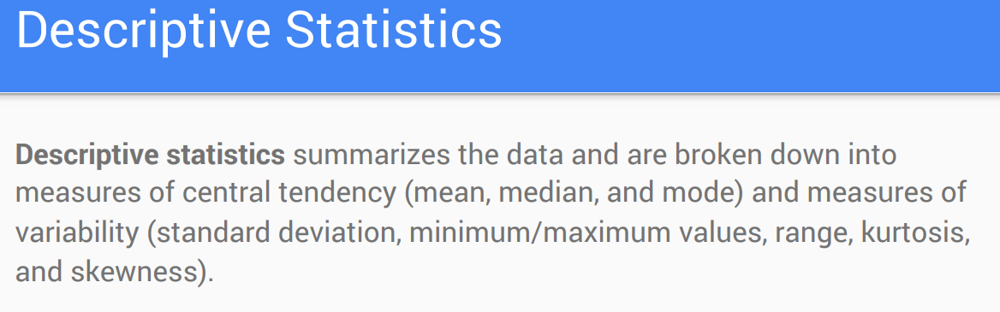

### Explain math concepts behind basic ml algorithms like linear regression, logistic regression, random forest , k-neighbours and svm

Sure, I'd be happy to explain the math concepts behind some basic machine learning algorithms:

1. **Linear Regression**:
   - Linear regression is a simple algorithm used for predicting a continuous value. It works by finding the best-fitting linear relationship between the independent variables (features) and the dependent variable (target).
   - The model's prediction is calculated as the weighted sum of the input features, where the weights are learned during the training process. The goal is to minimize the difference between the predicted values and the actual values.
   - Mathematically, the model can be represented as: 
     y = w0 + w1*x1 + w2*x2 + ... + wn*xn
     where y is the predicted value, w0 is the bias term, w1, w2, ..., wn are the weights, and x1, x2, ..., xn are the input features.

2. **Logistic Regression**:
   - Logistic regression is used for binary classification tasks. It estimates the probability that a given input belongs to a particular class.
   - The algorithm applies the logistic function (sigmoid function) to the linear combination of input features to map the output to the range [0, 1].
   - Mathematically, the model can be represented as:
     p = 1 / (1 + e^-(w0 + w1*x1 + w2*x2 + ... + wn*xn))
     where p is the predicted probability, and e is the base of the natural logarithm.

3. **Random Forest**:
   - Random Forest is an ensemble learning method that combines multiple decision trees to make predictions. Each tree in the forest is trained on a random subset of the training data and a random subset of the features.
   - During prediction, the output of each tree is aggregated to make the final prediction.
   - The algorithm uses the concept of bagging (bootstrap aggregating) and random feature selection to improve the model's performance and reduce overfitting.

4. **K-Nearest Neighbors (K-NN)**:
   - K-NN is a simple algorithm used for both classification and regression tasks. It classifies a new data point based on the majority class of its k nearest neighbors.
   - The distance metric (e.g., Euclidean distance) is used to measure the similarity between data points.
   - Mathematically, the algorithm calculates the distance between the new data point and all other data points in the training set to find the k nearest neighbors.

5. **Support Vector Machine (SVM)**:
   - SVM is a powerful algorithm used for both classification and regression tasks. It finds the hyperplane that best separates the data points into different classes.
   - The algorithm aims to maximize the margin between the hyperplane and the nearest data points (support vectors).
   - Mathematically, SVM solves an optimization problem to find the optimal hyperplane that maximizes the margin while minimizing the classification error.

These are simplified explanations of the math concepts behind these popular machine learning algorithms. Each algorithm has its own mathematical principles and optimization techniques that make them suitable for different types of tasks.

-----------------
### when do we use each of the models

Here are some guidelines on when to use each of the mentioned machine learning models:

1. **Linear Regression**:
   - Use linear regression when you have a continuous target variable and want to establish a linear relationship between the input features and the target.
   - It is suitable for tasks such as predicting house prices, stock prices, or sales forecasting.

2. **Logistic Regression**:
   - Use logistic regression when you have a binary classification problem and need to estimate the probability of an instance belonging to a particular class.
   - It is commonly used in tasks like spam detection, customer churn prediction, and medical diagnosis.

3. **Random Forest**:
   - Use random forest when you need a robust and accurate model for classification or regression tasks.
   - It is effective for handling large datasets with high dimensionality and can capture complex relationships in the data.
   - Random forest is suitable for tasks like images/image classification, fraud detection, and recommendation systems.

4. **K-Nearest Neighbors (K-NN)**:
   - Use K-NN when you have a small to medium-sized dataset and want a simple and easy-to-understand algorithm for classification or regression.
   - It is a non-parametric method that can be used for both classification and regression tasks.
   - K-NN is suitable for tasks like pattern recognition, anomaly detection, and collaborative filtering.

5. **Support Vector Machine (SVM)**:
   - Use SVM when you have a binary classification problem and need a powerful algorithm that can find complex decision boundaries.
   - It is effective in high-dimensional spaces and is robust against overfitting.
   - SVM is suitable for tasks like text classification, images/image recognition, and bioinformatics.

These guidelines are not strict rules, and the choice of model ultimately depends on the specific characteristics of the dataset, the nature of the problem, and the desired outcome. It is often beneficial to experiment with multiple algorithms and evaluate their performance to determine the most suitable model for a given task.

-----------------
### what are ensemble methods and explain bagging and bossting

Ensemble methods are techniques in machine learning that combine multiple models to produce a single, stronger model. The main idea is that by aggregating the predictions of several models, the ensemble can achieve better performance than any individual model. Ensemble methods can help improve accuracy, reduce overfitting, and increase robustness against noise in the data.

### Types of Ensemble Methods

1. **Bagging (Bootstrap Aggregating)**:
   - **Concept**: Bagging aims to reduce variance by training multiple models on different subsets of the training data. Each subset is created by randomly sampling the original dataset with replacement (bootstrap sampling).
   - **Process**:
     1. Generate multiple bootstrap samples from the original dataset.
     2. Train a separate model (often of the same type) on each bootstrap sample.
     3. For predictions, aggregate the results from all models. For classification, this can be done by majority voting; for regression, by averaging the predictions.
   - **Example**: Random Forest is a popular bagging method that uses multiple decision trees. Each tree is trained on a different bootstrap sample, and the final prediction is made by averaging the predictions of all trees (for regression) or taking a majority vote (for classification).

2. **Boosting**:
   - **Concept**: Boosting aims to reduce both bias and variance by sequentially training models. Each new model is trained to correct the errors made by the previous models. The final prediction is a weighted sum of the predictions from all models.
   - **Process**:
     1. Start with an initial model (often a weak learner, like a shallow decision tree).
     2. Evaluate the model's performance and identify the instances it misclassified.
     3. Assign higher weights to the misclassified instances so that the next model focuses more on them.
     4. Train a new model on the weighted dataset.
     5. Repeat the process for a specified number of iterations or until a stopping criterion is met.
     6. Combine the predictions of all models, often using a weighted sum where models that perform better have more influence.
   - **Example**: AdaBoost (Adaptive Boosting) is a well-known boosting algorithm that adjusts the weights of misclassified instances and combines the predictions of multiple weak learners to create a strong classifier.

### Summary

- **Bagging** reduces variance by averaging predictions from multiple models trained on different subsets of the data, while **Boosting** reduces bias by sequentially training models that focus on correcting the errors of previous models. Both methods leverage the strengths of multiple models to improve overall performance in machine learning tasks.

-----------------
### how to handle bias in a dataset

Handling bias in a dataset is crucial in machine learning to ensure that the model does not learn and perpetuate unfair or inaccurate patterns. Here are some common techniques to address bias in a dataset:

1. Data Collection: Ensure that the dataset is representative of the population it aims to model. Collect diverse and balanced data to avoid underrepresentation or overrepresentation of certain groups.

2. Data Preprocessing: 
   - Identify and quantify bias in the dataset using metrics like disparate impact analysis or disparate error rates.
   - Mitigate bias through techniques like reweighting samples, oversampling or undersampling, and generating synthetic data.
   - Remove or correct biased features that may lead to discriminatory outcomes.

3. Fairness-aware Algorithms: Use algorithms that are designed to mitigate bias and promote fairness, such as fairness-aware classifiers or bias correction techniques.

4. Regular Monitoring: Continuously monitor the model's performance and outcomes to detect and address bias that may arise during model deployment or as the data evolves.

5. Transparency and Accountability: Document and communicate the steps taken to address bias in the dataset to ensure transparency and accountability in the machine learning process.

By implementing these strategies, data scientists and machine learning practitioners can work towards reducing bias in datasets and developing more fair and ethical machine learning models.

-----------------
### what are the statistical concepts used in ml

Statistical concepts play a crucial role in machine learning for data analysis, model training, and evaluation. Some of the key statistical concepts used in machine learning include:

1. Descriptive Statistics: Descriptive statistics are used to summarize and describe the main features of a dataset. This includes measures such as mean, median, mode, standard deviation, variance, and percentiles.

2. Inferential Statistics: Inferential statistics are used to make inferences and predictions about a population based on a sample of data. Techniques like hypothesis testing, confidence intervals, and regression analysis fall under this category.

3. Probability Distributions: Understanding different probability distributions, such as Gaussian (normal), Bernoulli, Binomial, Poisson, and others, is essential for modeling uncertainty in data and generating random variables.

4. Hypothesis Testing: Hypothesis testing is used to determine whether a hypothesis about a population parameter is supported by the data. Common tests include t-tests, chi-square tests, and ANOVA.

5. Regression Analysis: Regression analysis is used to model the relationship between one or more independent variables and a dependent variable. Linear regression, logistic regression, and polynomial regression are common techniques.

6. Classification and Clustering: Statistical concepts like Bayes' theorem, k-nearest neighbors, and Gaussian mixture models are used in classification and clustering tasks to assign labels or group data points based on their features.

7. Resampling Methods: Techniques like cross-validation, bootstrapping, and permutation testing are used to assess the performance of machine learning models and estimate their generalization error.

Understanding these statistical concepts is essential for data preprocessing, model selection, evaluation, and interpretation in machine learning tasks.

-----------------
### explain the t-tests, chi-square tests, and ANOVA.

Sure, here's an explanation of t-tests, chi-square tests, and ANOVA:

1. T-Tests:
   - T-tests are statistical tests used to determine if there is a significant difference between the means of two groups.
   - There are different types of t-tests, such as independent samples t-test (used when comparing means of two independent groups) and paired samples t-test (used when comparing means of the same group at different times).
   - The t-test calculates a t-statistic, which is then compared to a critical value from the t-distribution to determine if the difference between the means is statistically significant.

2. Chi-Square Tests:
   - Chi-square tests are used to determine if there is a significant association between two categorical variables.
   - The most common type is the chi-square test of independence, which is used to test if there is a relationship between two categorical variables in a contingency table.
   - The test calculates a chi-square statistic, which is compared to a critical value from the chi-square distribution to determine if the association is statistically significant.

3. ANOVA (Analysis of Variance):
   - ANOVA is a statistical test used to compare the means of three or more groups to determine if there is a significant difference between them.
   - ANOVA tests the null hypothesis that all group means are equal against the alternative hypothesis that at least one group mean is different.
   - ANOVA calculates an F-statistic, which is compared to a critical value from the F-distribution to determine if the differences between group means are statistically significant.

These statistical tests are commonly used in hypothesis testing, group comparison, and association analysis in various fields, including machine learning, to make informed decisions based on data analysis.

-----------------
### provide simple examples for t-tests, chi-square tests, and ANOVA.

Sure, I can provide simple examples for each of these statistical tests:

1. **T-Test:**
   - **Scenario:** You want to compare the mean heights of two different groups of students, Group A and Group B, to see if there is a significant difference between them.
   - **Hypothesis:** Null Hypothesis (H0): The mean height of Group A is equal to the mean height of Group B. Alternative Hypothesis (H1): The mean height of Group A is not equal to the mean height of Group B.
   - **T-Test:** You would use a two-sample t-test to determine if there is a significant difference in the mean heights of the two groups.

2. **Chi-Square Test:**
   - **Scenario:** You want to investigate if there is a relationship between two categorical variables, such as gender (male/female) and smoking status (smoker/non-smoker).
   - **Hypothesis:** Null Hypothesis (H0): There is no association between gender and smoking status. Alternative Hypothesis (H1): There is an association between gender and smoking status.
   - **Chi-Square Test:** You would use a chi-square test of independence to determine if there is a significant association between gender and smoking status.

3. **ANOVA (Analysis of Variance):**
   - **Scenario:** You want to compare the mean scores of three or more different groups on a test to see if there is a significant difference in performance.
   - **Hypothesis:** Null Hypothesis (H0): The mean scores of all groups are equal. Alternative Hypothesis (H1): At least one group has a different mean score.
   - **ANOVA:** You would use a one-way ANOVA to test if there is a significant difference in the mean scores of the groups.

-----------------
### what values do all of these tests return

The t-tests, chi-square tests, and ANOVA return different statistical values that help in determining the significance of the results. Here are the key values returned by each of these tests:

1. T-Tests:
   - T-Statistic: The t-test calculates a t-statistic, which measures the difference between the means of two groups relative to the variance within the groups.
   - P-Value: The p-value associated with the t-statistic indicates the probability of observing the data if the null hypothesis (no difference between the means) is true. A lower p-value suggests stronger evidence against the null hypothesis.

2. Chi-Square Tests:
   - Chi-Square Statistic: The chi-square test calculates a chi-square statistic, which quantifies the difference between the observed and expected frequencies in a contingency table.
   - P-Value: The p-value associated with the chi-square statistic indicates the probability of observing the data if the variables are independent. A lower p-value suggests a significant association between the variables.

3. ANOVA (Analysis of Variance):
   - F-Statistic: ANOVA calculates an F-statistic, which compares the variability between group means to the variability within groups.
   - P-Value: The p-value associated with the F-statistic indicates the probability of observing the data if all group means are equal. A lower p-value suggests at least one group mean is significantly different.

These statistical values are used to make decisions about the null hypothesis, determine the significance of the results, and draw conclusions based on the data analysis performed using these tests.

-----------------
### explain standard deviation, variance, and percentiles.

Certainly! Here's an explanation of standard deviation, variance, and percentiles:

1. Variance:
   - Variance is a measure of the dispersion of values in a dataset.
   - It is the average of the squared differences between each value and the mean of the dataset.
   - Variance provides a measure of how much the values in a dataset differ from the mean value.
   - Variance is used to calculate the standard deviation, as the standard deviation is the square root of the variance.
  
2. Standard Deviation:
   - Standard deviation is another measure of the dispersion or spread of a set of values around the mean.
   - It quantifies how much the values in a dataset vary from the mean value.
   - A low standard deviation indicates that the values are close to the mean, while a high standard deviation indicates that the values are spread out.
   - The standard deviation is calculated as the square root of the variance.

3. Percentiles:
   - Percentiles are values that divide a dataset into 100 equal parts, representing the percentage of data points that fall below a certain value.
   - For example, the 25th percentile (also known as the first quartile) represents the value below which 25% of the data points fall.
   - Percentiles are useful for understanding the distribution of data and identifying outliers or extreme values.
   - Common percentiles include the median (50th percentile), quartiles (25th, 50th, and 75th percentiles), and percentiles like the 90th or 95th.

Understanding standard deviation, variance, and percentiles is essential for analyzing the variability and distribution of data in statistics and machine learning. These measures provide valuable insights into the spread and characteristics of a dataset.

-----------------
### Trimmeded-mean


-----------------
### weighhted mean


-----------------
### descriptive statistics


-----------------
### Intro to statistics
[statistics](<../../Users/1688447/OneDrive - TCS COM PROD/Documents/python/learning/introductiontostatisticswithpython21611725113445.pdf>)


-----------------
### explain types of skewness in data and how to find them

Skewness is a measure of the asymmetry of the probability distribution of a real-valued random variable. There are three main types of skewness that can be observed in data:

1. Positive Skewness (Right Skewness):
   - In a positively skewed distribution, the tail on the right side of the distribution is longer or fatter than the left side.
   - The mean is typically greater than the median, and the mode is less than the median.
   - The distribution is skewed to the right, with a long tail on the right side.

2. Negative Skewness (Left Skewness):
   - In a negatively skewed distribution, the tail on the left side of the distribution is longer or fatter than the right side.
   - The mean is typically less than the median, and the mode is greater than the median.
   - The distribution is skewed to the left, with a long tail on the left side.

3. Zero Skewness:
   - A distribution is considered to have zero skewness if it is symmetric, with the mean, median, and mode all being equal.
   - The distribution is balanced and does not exhibit any skewness in either direction.

To find the skewness in a dataset, you can use the skewness function available in many statistical software packages or programming languages. The skewness function calculates the skewness coefficient, which quantifies the degree and direction of skewness in the data distribution. 

For example, in Python using the scipy library, you can calculate skewness as follows:
```python
from scipy.stats import skew

data = [1, 2, 3, 4, 5, 6, 7, 8, 9, 10]
skewness = skew(data)
print("Skewness:", skewness)
```


By analyzing the skewness coefficient, you can determine the type of skewness present in the data distribution and understand the shape and characteristics of the dataset.


-----------------
### what does linear in linear regression mean ?

In the context of linear regression, the term "linear" refers to the relationship between the independent variable(s) and the dependent variable being modeled. 

In a linear regression model, the relationship between the independent variable(s) and the dependent variable is assumed to be linear, meaning that the change in the dependent variable is directly proportional to the change in the independent variable(s). This relationship is represented by a straight line in a two-dimensional space or a hyperplane in a higher-dimensional space.

Mathematically, a simple linear regression model can be represented as:

\[ y = mx + b \]

Where:
- \( y \) is the dependent variable
- \( x \) is the independent variable
- \( m \) is the slope of the line, representing the change in \( y \) for a unit change in \( x \)
- \( b \) is the y-intercept, representing the value of \( y \) when \( x = 0 \)

In multiple linear regression, where there are multiple independent variables, the relationship is still linear, but the model becomes:

\[ y = b_0 + b_1x_1 + b_2x_2 + ... + b_nx_n \]

Where:
- \( y \) is the dependent variable
- \( x_1, x_2, ..., x_n \) are the independent variables
- \( b_0, b_1, b_2, ..., b_n \) are the coefficients of the independent variables

Therefore, in linear regression, the term "linear" signifies that the relationship between the variables is a linear combination of the independent variables, and the model assumes a linear relationship between the variables being studied.

-----------------
### what is the null hypothesis used for considering linear regression as the model for the dataset

In the context of linear regression, the null hypothesis is typically used to assess the significance of the relationship between the independent variable(s) and the dependent variable. The null hypothesis in linear regression is often formulated as follows:

**Null Hypothesis (H0):** There is no significant relationship between the independent variable(s) and the dependent variable. In other words, the coefficients of the independent variables in the linear regression model are equal to zero.

When considering linear regression as the model for a dataset, the null hypothesis helps in determining whether the independent variables have a statistically significant impact on the dependent variable. The null hypothesis assumes that any observed relationship between the independent and dependent variables is purely due to random chance and not a true relationship.

To test the null hypothesis in linear regression, statistical methods such as hypothesis testing or p-values are commonly used. If the p-value associated with the coefficient of an independent variable is less than a chosen significance level (e.g., 0.05), then the null hypothesis is rejected, indicating that there is a significant relationship between that independent variable and the dependent variable.

In summary, the null hypothesis in linear regression is used to assess the significance of the relationship between the independent variables and the dependent variable. It helps in determining whether the linear regression model is a suitable representation of the dataset and whether the independent variables have a statistically significant impact on the dependent variable.

-----------------
### explain the same for logistic regression

In logistic regression, the null hypothesis is related to the coefficients of the independent variables in the model. Logistic regression is commonly used for binary classification tasks where the dependent variable is categorical and has two possible outcomes (e.g., 0 or 1, Yes or No).

The null hypothesis in logistic regression is typically formulated as follows:

**Null Hypothesis (H0):** There is no significant relationship between the independent variables and the log-odds of the dependent variable being in a particular category. In other words, the coefficients of the independent variables in the logistic regression model are equal to zero.

When considering logistic regression as the model for a dataset, the null hypothesis helps in determining whether the independent variables have a statistically significant impact on the log-odds of the dependent variable being in a particular category.

To test the null hypothesis in logistic regression, statistical methods such as hypothesis testing or p-values are used. If the p-value associated with the coefficient of an independent variable is less than a chosen significance level (e.g., 0.05), then the null hypothesis is rejected, indicating that there is a significant relationship between that independent variable and the log-odds of the dependent variable.

In logistic regression, the coefficients of the independent variables are used to calculate the log-odds of the dependent variable being in a particular category. The null hypothesis tests whether these coefficients are statistically significant in predicting the outcome.

In summary, the null hypothesis in logistic regression is used to assess the significance of the relationship between the independent variables and the log-odds of the dependent variable being in a particular category. It helps in determining whether the logistic regression model is a suitable representation of the dataset and whether the independent variables have a statistically significant impact on the outcome variable.

-----------------
### what is central limit theorem

The Central Limit Theorem is a fundamental concept in statistics. It states that when independent random variables are added together, their sum tends toward a normal distribution (also known as a Gaussian distribution), regardless of the original distribution of the variables themselves. This theorem is important because it allows us to make inferences about a population based on a sample, even if the population distribution is unknown.

-----------------
### what is a normal distribution

A normal distribution, also known as a Gaussian distribution, is a continuous probability distribution that is symmetric around its mean. In a normal distribution, **the mean, median, and mode are all equal**, and the data is evenly distributed around this central value. The shape of a normal distribution is characterized by the familiar bell curve, with the majority of the data falling near the mean and progressively fewer data points further away from the mean. Many natural phenomena and statistical processes follow a normal distribution, making it a widely used model in various fields such as statistics, economics, and natural sciences.

-----------------
### explain the different types of distance measuring systems in classification algorithms like KNN
In classification algorithms like K-Nearest Neighbors (KNN), distance measuring systems play a crucial role in determining the similarity between data points. Here are some common types of distance metrics used in KNN and other classification algorithms:

1. Euclidean Distance: This is the most common distance metric used in KNN. It calculates the straight-line distance between two data points in a Euclidean space. The formula for Euclidean distance between two points (x1, y1) and (x2, y2) in a 2D space is: 
   
   \[ \sqrt{(x2 - x1)^2 + (y2 - y1)^2} \]

2. Manhattan Distance: Also known as City Block distance, this metric calculates the distance between two points by summing the absolute differences between their coordinates. In a 2D space, the Manhattan distance between two points (x1, y1) and (x2, y2) is:
   
   \[ |x2 - x1| + |y2 - y1| \]

3. Minkowski Distance: This is a generalization of both Euclidean and Manhattan distances. The formula for Minkowski distance between two points (x1, y1) and (x2, y2) in a 2D space is:
   
   \[ \left( \sum_{i=1}^{n} |x2_i - x1_i|^p \right)^{1/p} \]
   
   where 'p' is a parameter that determines the type of distance metric. When p=1, it is equivalent to Manhattan distance, and when p=2, it is equivalent to Euclidean distance.

4. Cosine Similarity: In some cases, cosine similarity is used as a distance metric in classification algorithms. It measures the cosine of the angle between two vectors and is particularly useful when dealing with high-dimensional data.

5. Hamming Distance: This distance metric is used for categorical variables. It calculates the number of positions at which the corresponding elements are different between two vectors.

These are some of the common distance measuring systems used in classification algorithms like KNN. The choice of distance metric can significantly impact the performance of the algorithm, so it's essential to select the most appropriate one based on the characteristics of the data.


-----------------
### Confusion matrix

In a confusion matrix, which is commonly used to evaluate the performance of a classification model, there are several types of errors that can occur. The main types of errors in a confusion matrix are:

1. **True Positive (TP)**: The number of correctly predicted positive instances.

2. **True Negative (TN)**: The number of correctly predicted negative instances.

3. **False Positive (FP)**: Also known as **Type I error**, it occurs when the model incorrectly predicts a positive outcome when the actual outcome is negative.

4. **False Negative (FN)**: Also known as **Type II error**, it occurs when the model incorrectly predicts a negative outcome when the actual outcome is positive.

These errors can be further broken down into the following metrics:

- **Precision**: The proportion of true positive predictions among all positive predictions. It is calculated as TP / (TP + FP).

- **Recall (Sensitivity)**: The proportion of true positive predictions among all actual positive instances. It is calculated as TP / (TP + FN).

- **Specificity**: The proportion of true negative predictions among all actual negative instances. It is calculated as TN / (TN + FP).

- **F1 Score**: The harmonic mean of precision and recall, which provides a balance between the two metrics. It is calculated as 2 * (Precision * Recall) / (Precision + Recall).

Understanding these types of errors and metrics in a confusion matrix can help in assessing the performance of a classification model and identifying areas for improvement.

